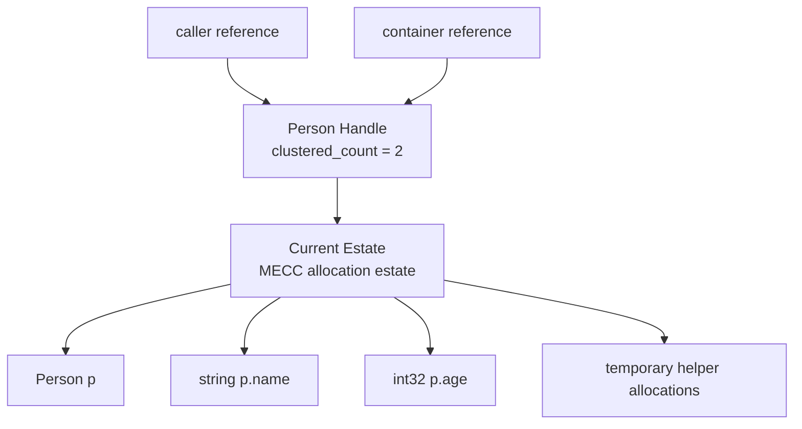
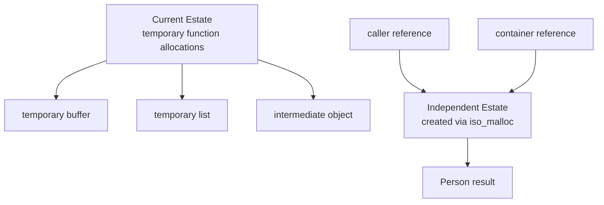

# Clyth

Clyth is an LLVM-based ahead-of-time (AOT) compiled systems programming language implemented in C++.

The language explores deterministic memory management and practical systems-programming ergonomics while preserving explicit control and predictable runtime behavior.

Clyth supports manual memory management by default and includes an optional memory-management model called **MECC**: **Managed Entanglement for Collapsible Collections**.

MECC explores deterministic memory management through scoped memory estates, estate-level ownership, and clustered reference counting. Instead of tracing an entire heap or reference-counting every object individually, MECC groups related allocations into estates and manages lifetime at the estate level.

---

## Current Status

Clyth currently has a working compiler frontend architecture centered around ANTLR4 and C++.

Implemented or scaffolded components include:

- ANTLR4 grammar and generated C++ frontend.
- Command-line compiler driver.
- Syntax-error reporting through ANTLR error listeners.
- Abstract Syntax Tree (AST) generation.
- Human-readable AST dump support.
- AST JSON output for visualization tooling.
- AST bytecode/debug output for future interpreter/debugger tooling.
- Semantic analysis pass infrastructure.
- Symbol and scope analysis scaffolding.
- MECC semantic annotation scaffolding.
- Linear lowering plan for code generation.
- LLVM IR generation scaffolding.

Current work focuses on completing LLVM IR generation and producing executable binaries from Clyth source programs.

---

## Compiler Pipeline

```text
Clyth source
    ↓
ANTLR4 lexer/parser
    ↓
Clyth AST generation
    ↓
Semantic analysis passes
    ↓
MECC analysis and annotation
    ↓
Linear lowering plan
    ↓
LLVM IR generation
    ↓
LLVM optimization
    ↓
Object file emission
    ↓
Linking
    ↓
Native executable
```

The frontend is intentionally structured into separate stages so new language checks, MECC rules, and code-generation behavior can be added without intermixing parsing, semantic analysis, and backend lowering.

---

## Design Goals

Clyth is designed around the following goals:

- Explicit control over memory and runtime behavior.
- Predictable performance.
- Low runtime overhead.
- Ahead-of-time compilation.
- LLVM-based optimization and portability.
- C interoperability.
- Practical systems-programming ergonomics.
- Optional deterministic memory-management support through MECC.
- A compiler architecture that can support future tooling such as formatting, language-server features, debugging, and package management.

Clyth is not designed to hide systems details from the programmer. Instead, it aims to make low-level programming easier to reason about while preserving control.

---

## Core Language Characteristics

- Ahead-of-time compiled.
- LLVM IR backend.
- C++ compiler implementation.
- Manual memory management by default.
- Optional MECC scopes and MECC functions.
- Pass-by-reference semantics for objects.
- Pass-by-value semantics for primitive types.
- Optional semicolons.
- C interoperability through `extern C`.
- Built-in syntax for lists, fixed arrays, maps, and sets.
- Struct declarations.
- Method syntax for structs.
- Function declarations.
- Control flow.
- Template-string token support.
- AST output formats for visualization and future tooling.

---

# Example Syntax

> GitHub Markdown does not know Clyth syntax yet, so examples may use nearby language tags for highlighting.

## Hello World with C Interop

```c
extern C int32 printf(string fmt, ...)

int32 main() {
    printf("Hello from Clyth!\n")
    return 0
}
```

---

## Structs and Manual Memory

```go
struct Person {
    string name,
    int32 age,
}

int32 main() {
    Person p = malloc(Person)

    p.name = "Harry"
    p.age = 30

    print(p.name)

    free(p)

    return 0
}
```

Manual memory management remains part of base Clyth. Developers can allocate and free memory explicitly when they want C-like control.

---

## Methods on Structs

Clyth supports method declarations attached to struct names.

```go
struct Rectangle {
    int32 width,
    int32 height,
}

Rectangle {
    Rectangle constructor() {
    }

    void destructor() {
    }

    int32 area() {
        return width * height
    }

    void _recalculateCache() {
    }
}

bool Rectangle.isSquare() {
    return width == height
}
```

Method blocks attach methods to an existing struct name.

```go
Rectangle {
    int32 area() {
        return width * height
    }
}
```

Qualified method declarations are also supported.

```go
bool Rectangle.isSquare() {
    return width == height
}
```

Underscore-prefixed method names are intended to represent private methods during semantic analysis.

---

## Lists

```go
int32[] values = [1, 2, 3, 4]
```

---

## Fixed Arrays

```go
int32[10] fixed_values = []
```

---

## Maps

```go
numeric:string sample_map = {
    1: "one",
    2: "two",
    1000: "thousand",
}
```

---

## Sets

```go
int32() unique_values = {
    1, 2, 3, 4, 5
}
```

---

## Type Relationships

```go
if instance is drawable {
    print("Drawable instance")
}
```

---

## MECC Function Syntax

```go
mecc Person buildPerson() {
    Person p = malloc(Person)
    return p
}
```

---

## MECC Block Syntax

```go
int32 main() {
    mecc {
        Person p = malloc(Person)
    }

    return 0
}
```

---

# Base Clyth Memory Model

The base Clyth language uses manually managed memory similar to C.

Core allocation primitives include:

- `malloc`
- `free`

Manual memory management is the default model because Clyth is intended to remain useful for low-level systems code, embedded-style development, runtime implementation, and performance-sensitive programming.

When code does not opt into MECC, allocation behavior remains explicit.

```go
Person p = malloc(Person)
free(p)
```

For allocations that need independent lifetimes when interacting with MECC-managed code, Clyth also reserves:

- `iso_malloc`

`iso_malloc` creates an allocation in its own independent estate.

---

# Why MECC Exists

Traditional systems programming usually forces developers to choose between several familiar memory-management tradeoffs.

| Memory approach | Ownership unit | Main strength | Main tradeoff |
|---|---:|---|---|
| C manual memory | Individual allocation / programmer | Maximum control | Easy to leak or free incorrectly |
| C++ `shared_ptr` / Rust `Arc` | Individual object | Shared ownership | Per-object reference counting overhead |
| Java / C# / Go-style GC | Runtime heap | Developer ergonomics | Runtime tracing and pause/latency concerns |
| Arena allocators | Region / arena | Very fast allocation and bulk free | Lifetime must be planned carefully |
| **MECC** | **Estate / allocation cluster** | **Bulk allocation with clustered counting** | **Independent lifetimes may require `iso_malloc`** |

MECC is not intended to replace manual memory management in Clyth.

Base Clyth exists for explicit control.

MECC exists for code where clustered allocation and deterministic reclamation make more sense than micromanaging every single object allocation.

> Instead of counting every object, count the memory estate that owns related objects.

---

# MECC Overview

## Managed Entanglement for Collapsible Collections

MECC is an optional memory-management model for Clyth.

Rather than relying on tracing garbage collection or per-object ownership tracking, MECC groups related allocations into **estates**.

An estate is a collection of allocations that share a common ownership boundary and lifetime relationship.

Ownership is tracked through clustered counting, where reference counts are maintained at the estate level rather than the individual object level.

Key design goals include:

- Deterministic memory reclamation.
- No tracing garbage collection.
- No stop-the-world pauses.
- Reduced ownership bookkeeping.
- Bulk allocation and reclamation.
- Predictable runtime behavior.
- Systems-level performance characteristics.
- Cleaner lifetime orchestration for groups of related allocations.

MECC-managed memory cannot be manually freed on a per-object basis.

Instead, estates are reclaimed when their clustered count reaches zero.

---

# What an Estate Looks Like



The estate is the ownership unit.

References point into handles associated with an estate, while the estate manages the lifetime of the related allocation cluster.

---

# Isolated Allocations

Sometimes one value should survive independently from nearby allocations.



The independent estate prevents one long-lived object from keeping an entire temporary estate alive.

This prevents **memory bubbling**, where a small long-lived allocation unintentionally extends the lifetime of a much larger allocation cluster.

---

# Example MECC Usage

```go
mecc Person[] buildPeople() {
    Person p = malloc(Person)
    Person p2 = iso_malloc(Person)

    p.name = "Harry"
    p.age = 30

    p2.name = "Ron"
    p2.age = 31

    return [p, p2]
}
```

Conceptually:

```text
current_estate = estate_create()
independent_estate = estate_create()

p  = estate_alloc(current_estate, sizeof(Person))
p2 = estate_alloc(independent_estate, sizeof(Person))
```

In this example:

- `p` belongs to the current estate.
- `p2` belongs to an independent estate.
- `iso_malloc` prevents a long-lived allocation from keeping a large temporary estate alive.

---

# MECC Rules

Inside a MECC function or block:

- `malloc(Type)` allocates into the current estate.
- `iso_malloc(Type)` allocates into a separate independent estate.
- `free(value)` is not allowed for MECC-owned values.
- Estate lifetime is managed through clustered counting.

Outside MECC scopes:

- `malloc(Type)` behaves as a manual allocation.
- `free(value)` behaves as manual reclamation.
- MECC estate rules do not apply unless code crosses into MECC-managed ownership.

---

# MECC and Base Clyth Together

```text
Base Clyth:
    manual malloc/free
    explicit programmer control

MECC Clyth:
    estate allocation
    clustered counting
    no per-object manual free
```

This keeps low-level and performance-critical manual code possible while allowing higher-level systems code to use deterministic estate-based reclamation where it helps.

---

# Compiler Architecture

The compiler is structured into separate phases.

## ANTLR4 Frontend

The grammar is defined using ANTLR4 and compiled into C++ lexer/parser/visitor files.

Generated ANTLR files are treated as generated artifacts and are not directly modified.

## AST Builder

The AST builder extends ANTLR's generated base visitor and converts the parse tree into Clyth's own AST representation.

ANTLR parse tree:

```text
grammar-shaped
```

Clyth AST:

```text
compiler-shaped
```

## Semantic Analysis

Semantic analysis is organized as a pass pipeline.

Current and planned semantic passes include:

- Top-level declaration collection.
- Type validation.
- Struct validation.
- Method validation.
- Function signature validation.
- Scope and symbol analysis.
- Control-flow validation.
- MECC ownership and allocation analysis.
- Future expression type-checking.
- Future overload/method-resolution checks.

This structure is intended to make new checks easy to add without modifying unrelated compiler stages.

## Lowering Plan

After semantic analysis, the AST is converted into a linear lowering plan.

This provides a code-generation-friendly view of the program so LLVM IR generation can iterate over a stable sequence of compiler objects rather than repeatedly traversing the tree.

## LLVM IR Generation

LLVM IR generation is the next major implementation stage.

The intended implementation path is:

1. Generate `int32 main() { return 42 }`.
2. Generate arithmetic expressions.
3. Generate local variables.
4. Generate function calls.
5. Generate `extern C` calls such as `printf`.
6. Generate structs.
7. Generate basic `malloc` / `free`.
8. Generate MECC runtime calls.
9. Generate estate allocation and clustered counting behavior.

---

# AST Output and Tooling Formats

Clyth can expose its AST in multiple formats for future tooling.

## Human-Readable AST

Used for compiler debugging.

```text
Program [program]
  FunctionDecl [function]
    ReturnStmt [return]
      LiteralExpr [literal] text='42'
```

## AST JSON

Used for visualization tooling, editor tooling, and external analysis.

```json
{
  "kind": "Program",
  "label": "program",
  "children": []
}
```

## AST Bytecode / Debug Format

Used as a future foundation for:

- Custom debugger.
- Interpreter experiments.
- AST inspection tools.
- Educational visualization.
- Possible REPL support.

This is not intended to replace LLVM IR. It is a tooling and introspection format.

---

# Planned Tooling

Clyth's long-term tooling roadmap includes:

- VSCode extension.
- Syntax highlighting.
- Snippets.
- Formatter.
- Language Server Protocol support.
- Diagnostics integration.
- Go-to-definition.
- Hover information.
- Package manager.
- Documentation generator.
- AST visualizer.
- AST bytecode interpreter/debugger.
- REPL or JIT-facing tooling.

A language is more than a compiler. Tooling is expected to become a first-class part of Clyth's development.

---

# Build and Toolchain Direction

Clyth is implemented in C++ and uses LLVM for backend code generation.

The Zig compiler toolchain is leveraged for portable static-linking support and as part of the broader toolchain strategy.

Preferred portability and licensing direction includes:

- LLVM.
- LLVM libc++ where appropriate.
- musl-libc where appropriate.
- Zig tooling for cross-platform build and linkage support.

The long-term goal is to provide a practical toolchain path that can produce native binaries while keeping external dependencies and licensing concerns understandable.

---

# Roadmap

## Frontend

- [x] ANTLR4 grammar.
- [x] C++ parser integration.
- [x] AST generation.
- [x] Syntax diagnostics.
- [x] Method grammar support.
- [x] AST JSON output.
- [x] AST bytecode/debug output.
- [x] Semantic pass infrastructure.
- [x] MECC semantic scaffolding.
- [x] Lowering-plan scaffolding.

## Backend

- [ ] LLVM IR generation for `main`.
- [ ] LLVM IR generation for literals.
- [ ] LLVM IR generation for arithmetic.
- [ ] LLVM IR generation for local variables.
- [ ] LLVM IR generation for function calls.
- [ ] `extern C` interop through LLVM.
- [ ] Struct layout lowering.
- [ ] Method lowering.
- [ ] Manual `malloc` / `free` lowering.
- [ ] MECC runtime lowering.

## Runtime

- [ ] Base runtime support.
- [ ] C interop helpers.
- [ ] MECC estate runtime.
- [ ] Estate allocation primitives.
- [ ] Estate clustered counting.
- [ ] Independent estate allocation through `iso_malloc`.

## Tooling

- [ ] VSCode extension.
- [ ] Syntax highlighting.
- [ ] Formatter.
- [ ] Language server.
- [ ] Package manager.
- [ ] Documentation generator.
- [ ] AST visualizer.
- [ ] Debugger/interpreter experimentation.

---

# AI-Assisted Development Philosophy

Clyth is a personal systems programming language project exploring compiler construction, runtime design, and deterministic memory management.

Modern AI-assisted development tools have been used throughout implementation to accelerate experimentation and reduce boilerplate, while language architecture, memory model design, runtime philosophy, and overall direction remain driven by the author's design goals.

The project aims to remain transparent regarding the role of AI assistance.

Neither of the following descriptions accurately reflects the nature of the work:

- "I wrote every line myself."
- "AI made the project."

Architecture, design goals, tradeoffs, and overall direction are considered the primary authorship contribution, while AI tools are treated as accelerators that help reduce repetitive implementation effort.

The goal is not to claim authorship through keystroke count, but through the ideas, constraints, and engineering decisions that shape the language.

---

# Project Philosophy

Clyth is built around a simple idea:

> Systems programming should remain explicit and predictable, but that does not mean the developer experience must remain unnecessarily difficult.

Clyth aims to preserve the power and control that make C-family systems programming valuable while exploring better abstractions for memory, ownership, tooling, and long-term maintainability.

---

# Acknowledgements and Legal Notes

- The Zig compiler toolchain is leveraged for portable static-linking support.
- musl-libc and LLVM libc++ are preferred over glibc/libstdc++ for portability and licensing preferences.
- External library licensing information is documented in:
  - `EXTERNAL_LIBRARIES_LICENSES.md`

## Legal Disclaimer

The author of Clyth is not legally responsible for ensuring license compliance for programs written using the language or its tooling.

Developers are responsible for verifying compliance with all third-party licenses included in their final binaries or distributions.

Consult legal professionals where appropriate.
