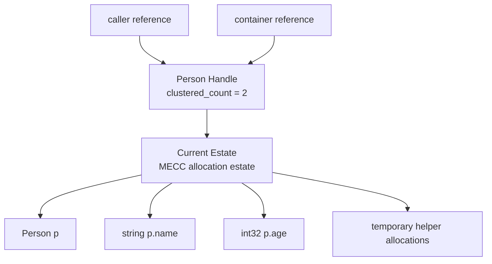
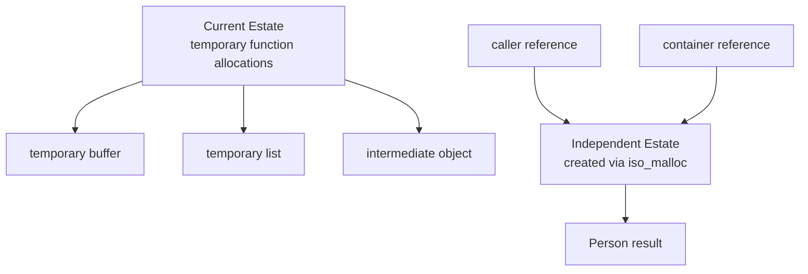

# Cobralyth, Clyth for short

## Current Status

The Clyth frontend is currently being explored between an Antlr4 frontend implementation and a C++ Pratt Parser implementation. This decision may swing in favor of Antlr4 if project time and effort exceeds the benefits of maintaining a custom parser.

The base language is designed around manually managed memory similar to C.
<br>
In addition to the base language, Clyth includes an optional memory-management framework called MECC (Managed Estates for Clustered Counting).

MECC explores region-based memory management through estate allocations and estate-level reference counting. Rather than managing individual objects through ARC or relying on tracing garbage collection, MECC manages ownership at the estate level and reclaims memory in clusters when an estate is no longer referenced.

The project is evolving and the README may be updated to reflect the latest design decisions.

---

# About Clyth

Clyth is an ahead-of-time (AOT) compiled systems programming language implemented in C++ with LLVM IR code generation.

The language is designed as an opinionated iteration of C focused on:
- explicit control
- predictable performance
- improved ergonomics for systems development
- LLVM-based optimization and portability

The long-term goal of Clyth is to provide a cleaner systems-programming experience without sacrificing the low-level control and runtime predictability expected from C-family languages.
<br><br>
Clyth supports manual memory management by default, allowing developers to retain full ownership over allocation and reclamation behavior when desired.
<br>
In addition to the base language, the project includes an optional memory-management framework called MECC (Managed Estates for Clustered Counting).
<br><br>
MECC explores deterministic memory management through estate allocations and clustered counting.
<br>
Rather than tracking ownership on a per-object basis or relying on tracing garbage collection, MECC groups related allocations into estates and manages ownership at the estate level.
<br><br>
This approach combines many of the allocation characteristics of arena allocators with deterministic reclamation through estate-level reference counting while avoiding tracing collectors and stop-the-world pauses.
<br>
The goal is to provide predictable memory behavior, low ownership overhead, and systems-level performance characteristics while reducing the amount of manual lifetime orchestration required by developers.

Current project work is focused on:
- parser architecture
- AST generation
- semantic analysis foundations
- LLVM IR lowering
- runtime design

---

# Clyth Language Spec V1

## Core Language Characteristics

- Ahead-of-Time (AOT) compiled.
- LLVM IR backend.
- Manual memory management by default.
- Optional MECC support through `mecc` scopes and functions.
- Pass-by-reference semantics for objects.
- Pass-by-value semantics for primitive types.
- Optional semicolons.
- C interoperability through `extern C`.
- Built-in collections syntax.

---

# Example Syntax

## Structs and Manual Memory

```go
struct Person {
    string name,
    int32 age,
}

int32 main() {
    Person p = malloc(Person)

    p.name = "Harry"
    p.age = 30

    print(p.name)

    free(p)

    return 0
}
```

## Lists

```go
int32[] values = [1, 2, 3, 4]
```

## Fixed Arrays

```go
int32[10] fixed_values = []
```

## Maps

```go
numeric:string sample_map = {
    1: "one",
    2: "two",
    1000: "thousand",
}
```

## Sets

```go
int32() unique_values = {
    1, 2, 3, 4, 5
}
```

## C Interoperability

```c#
extern C int32 printf(string fmt, ...)
```

## Type Relationships

```go
if instance is drawable {
    print("Drawable instance")
}
```

---

# Base Clyth Memory Model

The base Clyth language relies on manually managed memory similar to C.
<br>
Core allocation primitives include:
- `malloc`
- `free`

For allocations that require independent lifetimes when interacting with MECC-managed code, the language also reserves:

- `iso_malloc`

`iso_malloc` creates an allocation in its own independent estate.

---

# Why MECC Exists

Traditional systems programming usually forces developers to choose between a few familiar tradeoffs:

| Memory approach | Ownership unit | Main strength | Main tradeoff |
|---|---:|---|---|
| C manual memory | Individual allocation / programmer | Maximum control | Easy to leak or free incorrectly |
| C++ `shared_ptr` / Rust `Arc` | Individual object | Shared ownership | Per-object reference counting overhead |
| Java / C# / Go-style GC | Runtime heap | Developer ergonomics | Runtime tracing and pause/latency concerns |
| Arena allocators | Region / arena | Very fast allocation and bulk free | Lifetime must be planned carefully |
| **MECC estates** | **Estate / allocation cluster** | **Bulk allocation with clustered counting** | **Independent lifetimes may require `iso_malloc`** |

MECC is not trying to make Base Clyth disappear.
<br>
Base Clyth exists for manual control.
<br>
MECC exists for code where clustered allocation and deterministic reclamation make more sense than micromanaging every single object allocation.
<br>
> Instead of counting every object, count the memory estate that owns related objects.

---

# MECC Overview

## Managed Estates for Clustered Counting

MECC is an optional memory-management framework for Clyth.
<br>
Rather than relying on tracing garbage collection or per-object ownership tracking, MECC groups allocations into estates.
<br><br>
An estate is a collection of related allocations that share a common ownership boundary and lifetime relationship.
<br>
Ownership is tracked through clustered counting, where reference counts are maintained at the estate level rather than the individual object level.
<br>
<br>
Key design goals include:
- deterministic memory reclamation
- no tracing garbage collection
- no stop-the-world pauses
- reduced ownership bookkeeping
- bulk allocation and reclamation
- predictable runtime behavior
- systems-level performance characteristics

MECC-managed memory cannot be manually freed on a per-object basis.
<br>
Instead, estates are reclaimed when their clustered count reaches zero.

---

# What An Estate Looks Like


The estate is the ownership unit.

---

# Isolated Allocations

Sometimes one value should survive independently from nearby allocations.



The independent estate prevents one long-lived object from keeping an entire temporary estate alive.
<br>
This is commonly referred to as memory bubbling, where a small allocation unintentionally extends the lifetime of a much larger allocation cluster.

---

# Example MECC Usage

```go
mecc Person[] buildPeople() {
    Person p = malloc(Person)
    Person p2 = iso_malloc(Person)

    p.name = "Harry"
    p.age = 30

    p2.name = "Ron"
    p2.age = 31

    return [p, p2]
}
```

Conceptually:

```text
current_estate = estate_create()
independent_estate = estate_create()

p  = estate_alloc(current_estate, sizeof(Person))
p2 = estate_alloc(independent_estate, sizeof(Person))
```

In this example:

- `p` belongs to the current estate.
- `p2` belongs to an independent estate.
- `iso_malloc` prevents a long-lived allocation from keeping a large temporary estate alive.

---

# MECC Function and Block Syntax

```go
mecc Person buildPerson() {
    Person p = malloc(Person)
    return p
}
```

```go
int32 main() {
    mecc {
        Person p = malloc(Person)
    }

    return 0
}
```

Inside a MECC function or block:

- `malloc(Type)` allocates into the current estate.
- `iso_malloc(Type)` allocates into a separate estate.
- `free(value)` is not allowed for MECC-owned values.

Outside MECC scopes:

- `malloc(Type)` and `free(value)` behave normally.

---

# MECC and Base Clyth Together

```text
Base Clyth:
    manual malloc/free
    explicit programmer control

MECC Clyth:
    estate allocation
    clustered counting
    no per-object manual free
```

This keeps embedded-style, low-level, and performance-critical manual code possible while allowing application code to use MECC where it helps.

---

# Acknowledgements and Legal Notes

- The Zig compiler toolchain is leveraged for portable static-linking support.
- musl-libc and LLVM libc++ are preferred over glibc/libstdc++ for portability and licensing preferences.
- External library licensing information is documented in:
  - `EXTERNAL_LIBRARIES_LICENSES.md`

## Legal Disclaimer

The author of Clyth is not legally responsible for ensuring license compliance for programs written using the language or its tooling.
<br>
Developers are responsible for verifying compliance with all third-party licenses included in their final binaries or distributions.
<br>
Consult legal professionals where appropriate.
